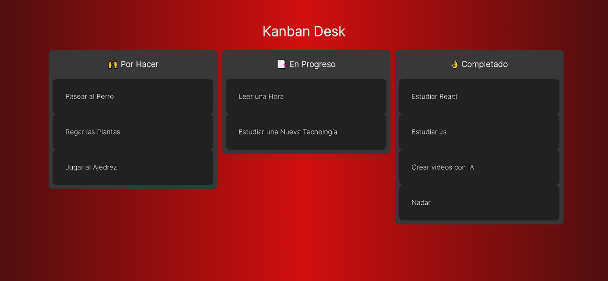
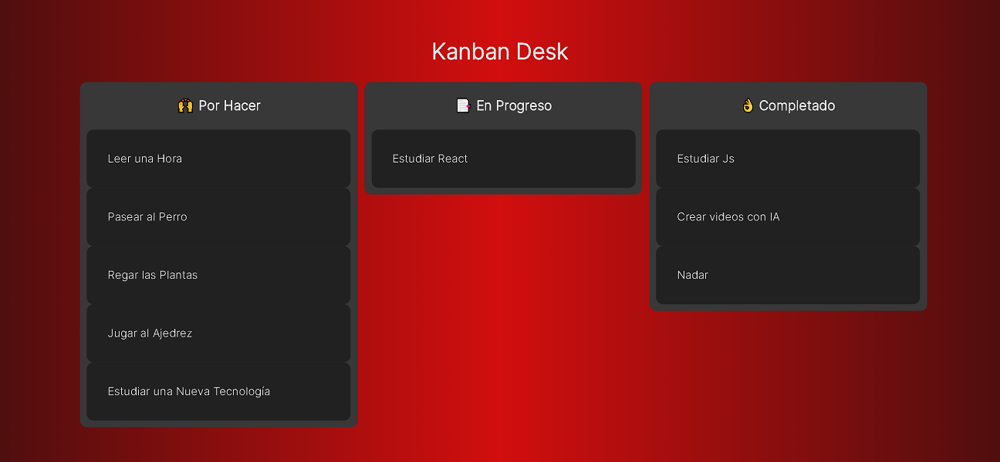

# React - Fundamentos

## Tecnologías Utilizadas:

- React (useState)
- React Beautiful Dnd (DragDropContext, Draggable, Droppable)
- Uuid (Unique Id - uuidv4)
- Git 

---
## Descripción 📘 

Proyecto Kanban Desk, con el cual podemos organizar nuestras tareas diarias usando drag and drop, gracias a la librería "react beautiful dnd". Se utiliza un mock-data como array, el cual puede modificarse a futuro a nivel de CRUD, y disponer así, de una práctica aplicación.
Mismo concepto puede aplicarse hacia otros proyectos, carritos de compras, juegos interactivos, entre otros.

---
## Vista Principal 🎨
---

